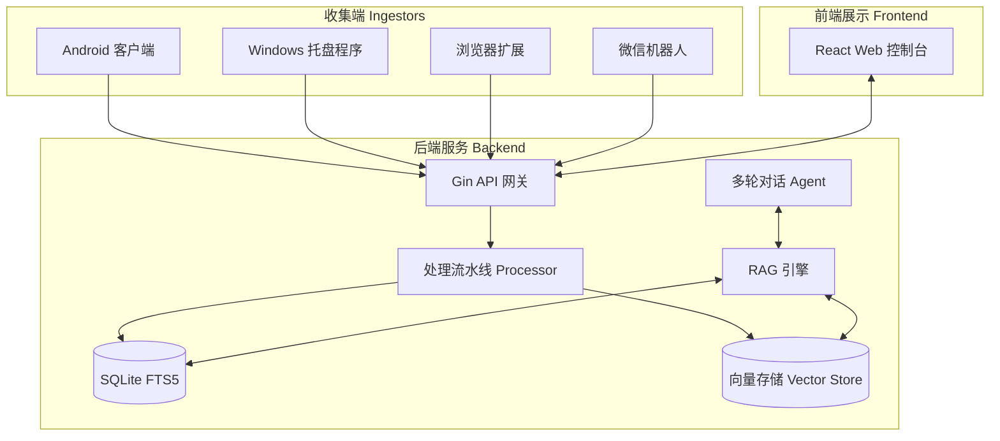

# 技术架构详解

Note All 采用模块化、轻量级的设计理念，核心是一个以 AI 为驱动的碎片化知识收集与检索系统。

## 系统概览 (System Overview)

## RAG 检索流水线

RAG (Retrieval-Augmented Generation, 检索增强生成) 系统遵循“宽进严排”的原则，确保高召回率与精准度。

### 1. 意图探测 (Intent Detection)
当查询进入系统时，首先通过 LLM/规则分析其意图类型：是普通搜索、总结请求、还是基于某些文档的提问。

### 2. 混合检索 (Hybrid Search)
系统并行开启三个维度的检索通道：
- **向量检索 (Vector Search)**：捕获语义相关性 (使用本地或云端嵌入模型)。
- **全文检索 (FTS5)**：基于 SQLite FTS5 引擎，捕获 OCR 文本和摘要中的精确匹配。
- **标签雷达 (Tag Matching)**：对匹配用户定义标签的笔记进行高权重加分。

### 3. 多维重排 (Re-ranking)
搜索结果通过加权公式进行合并与排序：
`最终得分 = 向量相似度(50%) + 全文匹配(25%) + 标签命中(15%) + 时效性权重(10%)`

## 多轮对话 Agent 设计

Agent 系统允许用户进行连续追问，并能执行复杂的任务指令。

### 意图状态机
Agent 追踪以下意图状态：
- `new_topic`：开启新话题。
- `follow_up`：指代追问 (例如：“它的特点是什么？”)。
- `clarify`：请求对上一步回答进行展开或澄清。
- `switch`：主动切换对话主题。
- `multi_step`：多步任务 (例如：“先找关于 X 的笔记，然后总结 Y”)。

### 查询重写 (Query Rewriting)
对于追问类问题，Agent 会结合上下文重写查询词。例如将“它的特点”重写为“设计模式的特点”，确保检索引擎能获取正确的信息。

更多底层实现细节请参考 [Agent 设计深度解析](design/agent.md)。

## 数据库设计

Note All 使用 **SQLite** 存储所有数据，强调零维护和便携性。

- **Notes 表**：存储核心内容、元数据及 OCR 结果。
- **Chunks 表**：将笔记切片，用于向量索引。
- **ChatSessions 表**：持久化多轮对话历史。
- **Templates 表**：存储自定义的 AI 处理 Prompt 模版。

## 远程 AI 智能体控制 (Remote Agent Control)

系统支持远程监控和操控安装在 Windows 端的 AI 编程智能体（如 Claude Code）。通过端到端加密协议，将复杂的终端输出转化为可交互的移动端视图。

### 核心特性
- **端到端加密 (E2EE)**：基于 NaCl Secretbox，确保代码和隐私在传输过程中不可泄露。
* **结构化同步**：将原始 TTY 流解析为“思考”、“执行”、“权限请求”等结构化事件。
* **人机协作 (HITL)**：远程批准或拒绝 AI 的敏感指令。

详细设计请参考 [远程 AI 智能体控制设计](design/remote-control.md)。
