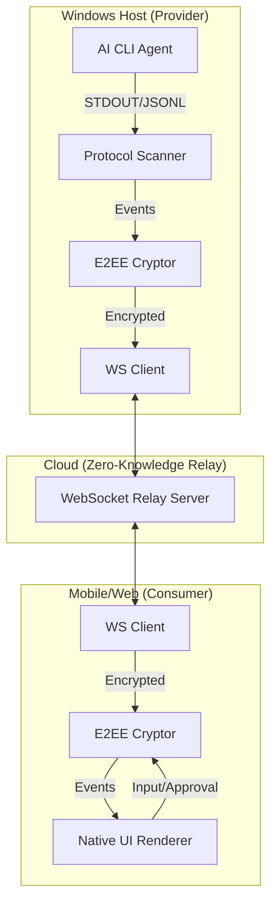

# 远程 AI 智能体控制系统 (Remote AI Agent Control) 设计文档

## 1. 概述

本项目旨在实现一个类似于 [Happy](https://github.com/slopus/happy) 的远程控制协议，允许用户通过移动端或 Web 端实时监控并交互运行在 Windows 开发机上的 AI 编程智能体（如 Claude Code）。

核心目标：
*   **低延迟交互**：实时流式传输终端输出。
*   **端到端加密 (E2EE)**：确保代码隐私，中继服务器不可见。
*   **结构化视图**：将终端原始输出转换为 UI 友好的结构化组件。
*   **安全审计 (HITL)**：远程批准/拒绝 AI 的敏感操作指令。

---

## 2. 系统架构

系统采用 **提供者 (Provider) - 中继 (Relay) - 消费者 (Consumer)** 架构。



### 2.1 组件分工
*   **Windows 客户端 (Go)**: 负责 PTY 模拟、日志流扫描、本地加密、以及与中继服务器的 WebSocket 连接。
*   **中继服务器 (Node.js/Go)**: 负责设备发现与数据透传，不持有任何密钥。
*   **移动/Web 端 (React/Native)**: 负责数据解密、结构化渲染、以及发送用户输入。

---

## 3. 安全与加密 (E2EE)

### 3.1 威胁模型
*   **中间人攻击**: 中继服务器可能被监听或被攻破。
*   **物理访问**: 仅信任持有 Access Key 的物理设备。

### 3.2 加密方案
*   **算法**: `NaCl secretbox` (XSalsa20-Poly1305) 或 `AES-256-GCM`。
*   **密钥派生**: 用户在 Windows 端设置一个 `Access Key`，通过 `Argon2` 或 `PBKDF2` 派生出 32 字节的会话密钥。
*   **Nonce 机制**: 每条消息使用唯一的单调递增 Nonce，防止重放攻击。

---

## 4. 协议设计 (Structured Protocol)

### 4.1 会话包格式 (Session Envelope)

我们不传输原始文本，而是传输结构化的 JSON 事件。

```json
{
  "type": "thought", 
  "content": "正在思考如何修改 main.go...",
  "timestamp": 1714123456
}

{
  "type": "tool_call",
  "tool": "bash",
  "command": "rm -rf /tmp/cache",
  "requires_approval": true
}
```

### 4.2 扫描器逻辑 (Scanner)
`Protocol Scanner` 负责实时解析 AI 智能体的输出管道。它会识别：
1.  **Thinking 块**: 识别智能体的思考内容。
2.  **Tool 调用**: 识别准备执行的命令。
3.  **Permission 请求**: 匹配特定的批准提示字符（如 `Allow? [y/N]`）。

---

## 5. 人机协同 (Human-in-the-loop)

### 5.1 指令批准流程
1.  **触发**: AI 智能体输出挂起，等待 `y/n` 输入。
2.  **通知**: Windows 客户端发送 `permission_request` 包至中继。
3.  **决策**: 手机端弹出对话框，展示命令详情及其安全影响评分。
4.  **执行**: 用户点击“同意”，Windows 端解密指令并向智能体 STDIN 注入 `y\n`。

### 5.2 策略授权 (Policy-based Approval)
为提高效率，支持以下授权策略：
*   **总是允许**: 允许无限制执行。
*   **只读允许**: 自动同意 `ls`, `cat`, `grep` 等无损指令。
*   **超时自动拒绝**: 30 秒无响应则视为拒绝。

---

## 6. 实现细节 (Windows Go Client)

### 6.1 PTY 处理
使用 `conpty` (Windows Pseudo Console) 以获得最佳兼容性：
*   依赖库: `github.com/iamabhishek-dubey/go-conpty`
*   处理 ANSI 转义码，确保颜色和光标位置正确。

### 6.2 异步同步模型
Go 客户端内部采用 `Action Queue` 模型，确保在弱网环境下指令不会乱序，支持离线缓冲。

---

## 7. 后续规划
1.  **多 Agent 支持**: 同时管理 Claude Code, Codex, Aider 等。
2.  **文件热预览**: AI 修改文件后，手机端可直接查看 Diff 并一键还原。
3.  **全局热键**: `Alt + H` 快速从 Windows 唤起远程同步状态。
