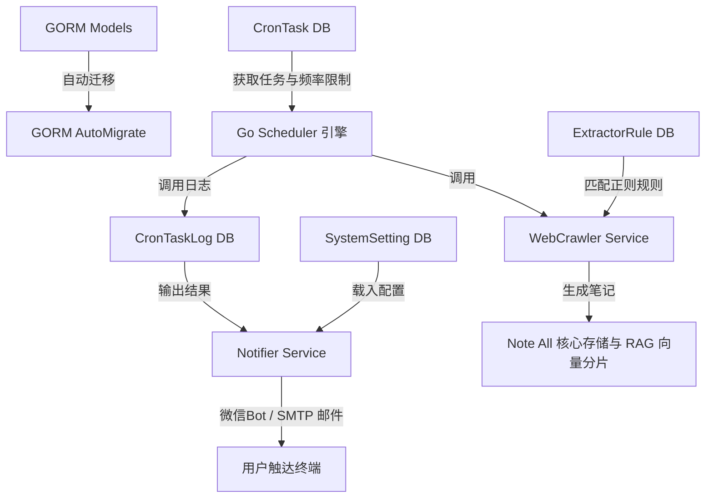

# PLAN: Phase E1 定时任务及基础服务实现计划

本计划为 Phase E1 "定时任务、网页自定义匹配抽取与多渠道结果推送" 功能的设计实现蓝图，保障系统按照敏捷、解耦、零膨胀的原则高质量落地。

---

## 1. 核心模块与依赖关系

在实现本阶段功能时，后端的任务流和配置依赖具有以下清晰链条：

---

## 2. 实施步骤与排期

整体开发划分为 5 个原子阶段：

### 阶段 1: 数据库模型与自动迁移（1天）
1. 在 `backend/models/cron_task.go` 中创建结构体：
   - `CronTask`：记录定时任务及特定 JSON 参数。
   - `CronTaskLog`：记录任务运行时间、执行结果摘要与详细错误栈。
   - `ExtractorRule`：自定义 URL 正则匹配模式与 HTML 抽取选择器。
   - `SystemSetting`：采用 Key-Value 设计存储 SMTP 发信全局通知配置。
2. 修改 `backend/models/note.go` 的 `SetupDBWithFTS` 函数，将以上 4 个模型注册进 GORM 迁移，确保系统启动时自动建表。

### 阶段 2: 任务分发器与推送引擎（1.5天）
1. 创建 `backend/service/cron_dispatcher.go`：
   - 定义通用的 `TaskHandler` 抽象接口，包含 `Execute(ctx, config)` 方法。
   - 建立无锁的处理器全局注册字典表 `map[string]TaskHandler`。
2. 创建 `backend/service/notifier_service.go`：
   - 提供从 `SystemSetting` 安全读取配置的读取方法。
   - 实现 SMTP 邮件客户端（基于标准库），支持 SSL/TLS 协议。
   - 实现直接绑定系统内置个人 Wechat 机器人进行消息推送。

### 阶段 3: 网页精准抽取与智能 Fallback（2.5天）
1. 创建 `backend/service/crawler_handler.go` 并实现 `TaskHandler` 接口：
   - 解包 `urls` 列表和 `rate_limit_ms`。
   - 对每一个链接启动网络请求，并应用单域名频率控制（`time.Sleep` 睡眠控制）。
   - 编译加载数据库中的全部正则表达式进行匹配。
   - **命中**：使用 `goquery` 通过配置的 Title, Body 选择器抽取 HTML 节点并净化。
   - **未命中**：Fallback 调用 `go-readability` 进行通用版面抽取。
   - 使用 `html-to-markdown` 转换为最终排版 Markdown 文本。
2. 接入系统的 `createImportedNote`，触发异步向量分片与大模型摘要。

### 阶段 4: 定时轮询调度引擎与路由集成（1.5天）
1. 创建 `backend/service/cron_scheduler.go` 引擎：
   - 实现常驻 goroutine 调度方法：定时 1 分钟扫描一次 `next_run_time <= now` 的活跃任务。
   - 实现多任务并发安全执行，用 `recover()` 拦截 Panic，保障即使网页请求超时或错误，调度器本身也不会崩溃。
   - 任务运行结束写回 `CronTaskLog` 并计算、更新下次运行时间。
2. 在 `backend/main.go` 的底层核心服务初始化段注入 `go service.StartCronScheduler(ctx)` 启动命令。
3. 创建 `backend/api/cron_task.go` 并注册接口路由：
   - 任务列表 CRUD、一键暂停/启用、立即触发执行（独立异步协程运行）。
   - 正则抽取规则 CRUD、系统全局配置（获取时将密码过滤为 `******` 脱敏，保存时对旧密码特殊判空）。

### 阶段 5: 前端仪表盘与通知面板集成（2.5天）
1. 新建 `frontend/src/api/cronApi.js` 封装全量网络请求。
2. 新建前端 `frontend/src/components/CronSettingsTab.jsx`：
   - 任务仪表盘：以卡片网格样式展示已有定时任务、最新运行状态、下次触发时间。
   - 规则编辑器：可视化填写正则表达式、测试按钮、以及 CSS 精准选择器（包含剔除项）。
   - 配置页面：以卡片和表单形式提交 SMTP 全局配置，并提供内置微信 Bot 助手的零配置自适应推送介绍。
   - 历史日志查看：抽屉展示形式，快速排查失败任务。
3. 修改 `frontend/src/components/SettingsModal.jsx` 注册新 tab。

---

## 3. 风险评估与规避策略

1. **SQLite 锁冲突风险**
   - *风险*：SQLite 默认对写操作是排他的。如果大量的后台定时任务同时结束、写回日志、修改笔记、更新向量索引，可能导致主 API 产生 `database is locked` 报错。
   - *策略*：调度引擎严格串行写回日志状态，或在 `RunSingleTask` 的状态归口处引入单一队列，使用专门的单线程写入，同时保持底层 SQLite 连接数 `MaxOpenConns(1)` 机制。
2. **抓取超时与连接泄漏**
   - *风险*：网络爬取部分网站时，由于慢连接导致 Go 底层套接字挂起，如果不配置超时，调度进程将很快耗尽文件描述符并拖垮后台。
   - *策略*：严格将 HTTP 客户端套接字超时时间限制在 30 ~ 45 秒内，并使用带有 Timeout 的 Context 控制爬虫退出。
3. **安全泄露风险**
   - *风险*：SMTP 密码和企业微信 API 密钥通过网络传输时，若暴露在网络中极不安全。
   - *策略*：密码在保存到数据库时采用加密或仅对特定管理路由显示。API 的 GET 获取时自动屏蔽为脱敏字符串（若更新时密码项为脱敏符号，则不修改密码原值）。

---

## 4. 关键验证里程碑

- **里程碑 1**: 数据库建表正常、API 接口对模拟数据连通通过。
- **里程碑 2**: 单个 crawler 定时任务手动跑通，网站文章精准抓取转换成 markdown 文件入库笔记列表。
- **里程碑 3**: 后台 1 分钟常驻 Ticker 触发任务跑通，邮件能够收到运行成功邮件，企业微信收到 Webhook 通报。
- **里程碑 4**: 前端定时任务 Tab 面板调试完毕，视觉动效与项目主体 Glassmorphism 磨砂玻璃、HSL 渐变风格完美统一，高保真完成。

---

*文档版本: 1.0 | 创建日期: 2026-05-10*
