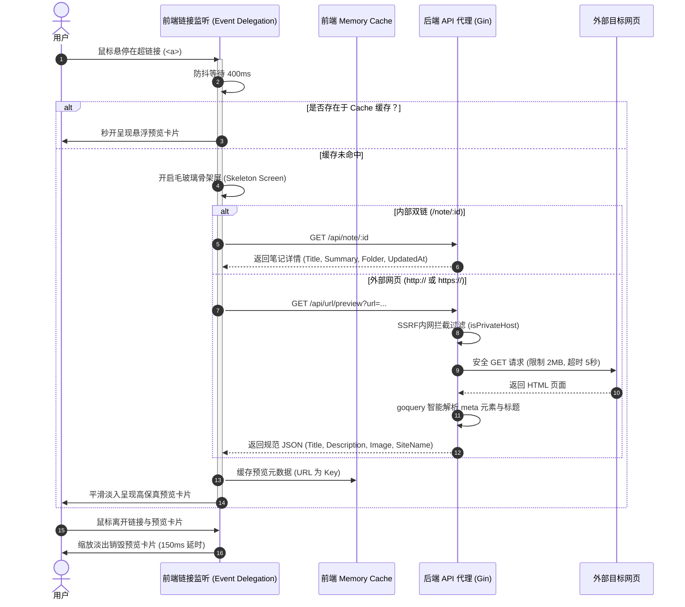

# PLAN: Wiki 风格 URL 链接预览实现计划

本计划为 Wiki 风格 URL 链接预览功能的设计与实现路线图。该功能旨在为系统内的内部链接和外部超链接建立高质感的悬浮预览，遵循安全、敏捷、解耦的开发模式。

---

## 1. 核心模块与数据流向

整个系统的动作序列与元数据传递如下图所示：

---

## 2. 实施步骤与排期

开发工作将划分为 4 个原子阶段：

### 阶段 1: 后端安全抓取代理 API 实现（1.5天）
1. **路由注册**：在 `backend/router/router.go` 的鉴权接口组中注册新端点：
   - `apiGroup.GET("/url/preview", noteApi.GetURLPreview)`
2. **控制器逻辑**：在 `backend/api/note.go` 中实现 `GetURLPreview` 方法：
   - 解析 URL 并调用已有的 `isPrivateHost` 辅助函数过滤内网/局域网，防范 SSRF。
   - 使用 `net/http` 发起带 5 秒超时的 GET 请求，配置标准的 User-Agent。
   - 包装 `io.LimitReader` 限制数据流大小为 2MB。
   - 使用 `goquery.NewDocumentFromReader` 提取 HTML，匹配 `og:title`、`og:description`、`og:image`、`og:site_name` 及标准 `<title>` / `description` 标签，进行字符编码清洗。
3. **连通性测试**：使用 PowerShell 脚本或 curl 手动请求 `/api/url/preview?url=https://github.com` 以验证返回格式与拦截机制。

### 阶段 2: 前端通用 Portal 预览卡片开发（1.5天）
1. **组件实现**：在 `frontend/src/components/` 下新建 `LinkPreviewPortal.jsx`：
   - 利用 `React Portal`（通过 `createPortal` 挂载在 `document.body`）避免父容器遮挡。
   - 设计圆角、磨砂玻璃背景（`backdrop-blur-md bg-modal/90 border border-borderSubtle shadow-2xl`），自带流畅的进场与退场微动画（`transition-all ease-out scale-95 opacity-0`，激活时 `scale-100 opacity-100`）。
   - 提供差异化的渲染方案：
     - **笔记模式**：展示翡翠绿（Emerald）风格，呈现分类面包屑、图标、摘要正文及更新时间。
     - **网页模式**：展示深邃蓝（Indigo）风格，呈现网站根域名、标题、描述、以及右侧的 `object-cover` 网页配图（若有）。
     - **骨架屏**：呈现极简灰色脉冲（`animate-pulse`）条块，消除生硬的白屏。

### 阶段 3: 前端全局事件监听与智能防抖集成（2天）
1. **轻量级 Hook 提取**：在 `frontend/src/hooks/` 新建 `useLinkPreview.js`：
   - 使用**全局事件委托 (Event Delegation)**：在根节点 `document.body` 监听 `mouseover` 和 `mouseout` 事件，捕捉带有特定特征（含有 `href` 属性）的 `a` 标签。这能无缝覆盖编辑器、预览器、历史会话中所有的链接，代码侵入性极低。
   - 内置防抖（Debounce）延时（400ms）机制，鼠标快速划过时不作任何请求。
   - 精准检测 `a` 标签的 `getBoundingClientRect()`，结合卡片尺寸与 Viewport 边界，智能修正预览卡片的 `left`/`top` 位置（上方对齐或下方对齐），防范卡片被视口裁剪。
   - 监听卡片自身的 `mouseenter`/`mouseleave` 事件，当用户将鼠标从链接移动到卡片上时，取消关闭定时器，维持显示。
2. **缓存集成**：内置轻量级 `Map` 对象作为会话级内存缓存，一旦请求成功，终身复用。

### 阶段 4: 前后端全路径打磨与视觉精调（1天）
1. **全局集成**：在 `frontend/src/App.jsx` 顶层引入 `<LinkPreviewPortal />` 并初始化 `useLinkPreview`。
2. **样式打磨**：
   - 精细调整暗色模式下的背景漫反射光晕。
   - 过滤内部链接预览文本中的原始 Markdown 语法，仅渲染纯净的文字大纲。
   - 拦截局域网等异常链接，卡片内展示极佳的优雅失败反馈，而非默默报错。

---

## 3. 风险评估与规避策略

1. **SSRF（服务端请求伪造）风险**
   - *风险*：攻击者悬停在恶意的内网 URL 时，可能导致后台向内网其他服务器发起请求并截取返回元数据。
   - *策略*：严格复用并扩展已有的 `isPrivateHost` 验证。所有非常规公网 IP（127.x.x.x, 10.x.x.x, 192.168.x.x 等）一律直接返回 `400` 并拒绝请求。
2. **HTML 解析崩溃与字符乱码**
   - *风险*：部分国内网页使用 GBK 或 GB2312 编码，抓取后直接作为 UTF-8 解码可能会产生大量乱码，影响视觉美观。
   - *策略*：通过 HTTP Response 的 `Content-Type` 及 HTML 中 `<meta charset>` 提取编码标识，若含有非 UTF-8 编码，则使用 Go 的标准库解码，保证文字完美呈现。
3. **定位错位与页面滚动**
   - *风险*：在页面有纵向滚动条时，如果定位未叠加 `window.scrollY`，当滚动页面后悬浮卡片将会出现位置偏移。
   - *策略*：在动态计算 Coords 时，采用 `rect.top + window.scrollY` 与 `rect.left + window.scrollX` 进行绝对定位，确保无论如何滚动，卡片都死死贴合链接位置。

---

## 4. 关键验证里程碑

- **里程碑 1**: 后端 `/api/url/preview` 代理接口调试通过，遇到局域网能成功阻断，对 Bilibili/Github 等主流站点提取元数据正确，无中文乱码。
- **里程碑 2**: 前端 `LinkPreviewPortal` 基本框架与进出场缩放微动画调试完毕，骨架屏脉冲渐变丝滑。
- **里程碑 3**: 前端全局事件监听与缓存器部署成功，悬停 `[[note:xx]]` 瞬间响应骨架屏，并根据响应拉取内部笔记详情，目录归属、Summary 展示行云流水。
- **里程碑 4**: 全路径交互调试无死角，鼠标滑出链接但滑入卡片时，卡片依然维持显示；当滑出两者时完美缩放淡出销毁。

---

*文档版本: 1.0 | 创建日期: 2026-05-17*
