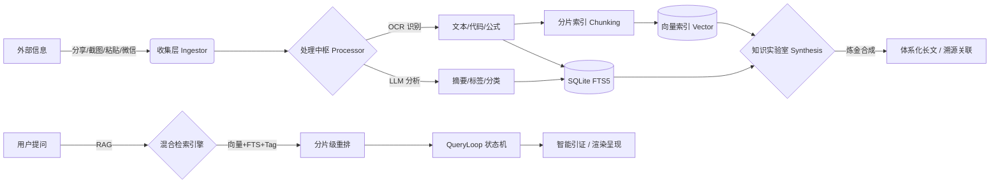

<div align="center">
  
  <h1>📦 Note All</h1>
  <p><b>碎片随手记，AI 即刻懂</b></p>
  <p>一款专注于"无感收集、AI 自动提取、极速检索"的个人碎片化知识管理系统</p>

  <p>
    
    
    
    
    
    
  </p>

  <br>
  
</div>

---

## 🌟 核心理念

> **告别繁琐分类，让 AI 成为你的私人档案员。**
>
> 无论是网页链接、灵光一现、还是手机截图，只需"分享"或"粘贴"，剩下的交给 Note All。

---

## 📑 目录

- [核心特性](#-核心特性)
- [工作流图解](#️-工作流图解)
- [技术架构](#️-技术架构)
- [RAG 检索设计](#-rag-检索设计)
- [Chat Agent 多轮对话设计](#-chat-agent-多轮对话设计)
- [知识实验室](#-知识实验室)
- [微信助手](#-微信助手-clawbot)
- [编译与打包](#️-编译与打包)
- [项目结构](#-项目结构)

---

## ✨ 核心特性

### 📥 无感收集 (Ingest)

| 特性 | 说明 |
|:---|:---|
| **Android 全局分享** | 系统原生集成，秒级归档 |
| **剪贴板智能嗅探** | App 获焦自动识别，一键入库 |
| **URL 智能剪藏** | 穿透反爬，Markdown 自动净化 |
| **Windows 全局热键** | `Alt+Q` 截图 / `Alt+Shift+Q` 闪记 |
| **浏览器剪藏扩展** | 划词剪藏及扩展弹窗，补全 PC 工作流 |
| **微信 ClawBot 接入** | 扫码即可将微信变为你的私人闪记入口 |

### 🧠 处理中枢 (Process)

| 特性 | 说明 |
|:---|:---|
| **OCR 极速识别** | 自研流水线，图片秒变文字 |
| **LLM 结构化分析** | 自动生成摘要，终结未命名时代 |
| **智能标签 (Auto-Tag)** | 根据内容深度提取主题特性 |
| **短文本优化策略** | 少于 50 字直接使用原文作摘要，节约 AI 算力 |
| **自定义 AI 模板** | 支持内建与自定义 Prompt 模板 |
| **多模态消息处理** | 不仅处理文字，更支持图片、文件自动收录 |

### 🔍 消费检索 (Consume)

| 特性 | 说明 |
|:---|:---|
| **RAG 语义问答** | 基于全库知识的深度对话 |
| **智能引证** | AI 回答实时溯源，确保真实可靠 |
| **混合检索引擎** | #标签联想、OCR 文本、AI 摘要并行 |
| **全功能渲染** | KaTeX 公式、GFM 表格一网打尽 |
| **智能记忆拼图** | AI 串联随机碎片激发灵感 |
| **隐式双链** | 基于标签自动发现并串联知识点 |
| **知识溯源 (Lineage)** | 合成笔记自动记录来源，支持一键跳回 |

---

## 🛠️ 工作流图解



---

## 🏗️ 技术架构

<details>
<summary>点击展开技术实现细节</summary>

| 模块 | 技术栈 | 说明 |
|:---|:---|:---|
| **服务端** | Golang + SQLite (FTS5) | 极致轻量，单文件运行，屏蔽所有重型中间件 |
| **Web 前端** | React 18 + TailwindCSS | 长短轮询探针达成局部无感刷新 |
| **PC 客户端** | Golang (Win32 API) | 纯血托盘程序，注册系统级原子热键 |
| **Android 客户端** | Kotlin + Jetpack Compose | 深度收编系统 Share Sheet 流量入口 |
| **AI 萃取中台** | PaddleOCR + ERNIE | 本地 OCR + 云端 LLM（支持 OpenAI API 兼容接口） |
| **知识炼金引擎** | 自研 | 跨笔记全量上下文计算，支持多对多父子关联溯源 |

</details>

---

## 📖 文档中心 (Documentation)

| 文档 | 说明 |
|:---|:---|
| [🚀 快速开始](docs/installation.md) | 环境要求、依赖编译与运行指南 |
| [💡 用户指南](docs/usage.md) | Android/PC/Web/微信等多端使用技巧 |
| [🏗️ 技术架构](docs/architecture.md) | RAG 检索设计、Agent 状态机、系统拓扑 |
| [🤖 Agent 设计](docs/design/agent.md) | 多轮对话 Agent 架构与实现细节 |
| [🔌 API 参考](docs/api-reference.md) | 后端服务 RESTful API 接口定义 |
| [🤝 贡献指南](CONTRIBUTING.md) | 如何参与项目开发与提交代码 |

---

## ✨ 核心特性

Note All 将碎片化知识管理分为三个标准阶段：

### 📥 1. 无感收集 (Ingest)
*   **多端覆盖**：Android 全局分享、Windows 截图 (`Alt+Q`)、浏览器剪藏扩展。
*   **自动处理**：实时 OCR 识别、LLM 摘要生成、智能标签提取。
*   **微信集成**：通过 WeChat ClawBot 协议，像发微信一样存笔记。

### 🧠 2. 深度处理 (Process)
*   **混合引擎**：基于 SQLite FTS5 的全文检索与本地向量检索并行。
*   **知识实验室**：由 AI 驱动的碎片笔记合成工具，辅助知识升华。
*   **多模态支持**：自动解析图片中的代码、数学公式及长文逻辑。

### 🔍 3. 极速消费 (Consume)
*   **RAG 问答**：基于全库知识的语义对话，支持智能引证溯源。
*   **多轮 Agent**：理解上下文指代词，支持复杂的多步检索任务。
*   **可视化图谱**：通过标签关联发现知识间的隐性连接。

---

## 🛠️ 编译与运行 (Build & Run)

```powershell
# Windows 环境下一键编译所有模块
.\build.ps1 -Module all
```
详细的编译步骤与环境配置请参考 [安装指南](docs/installation.md)。

---

## 📂 项目结构

```text
.
├── backend/           # Golang 服务端核心 (Gin + Gorm)
├── frontend/          # React Web 界面 (Vite + TailwindCSS)
├── android_client/    # Android 应用 (Jetpack Compose)
├── pc_client/         # Windows 托盘程序 (CGO + Win32)
├── browser_extension/ # 浏览器剪藏协议实现
└── docs/              # 详细技术与使用文档
```

---

## 📄 License

Project is licensed under the [MIT License](LICENSE).