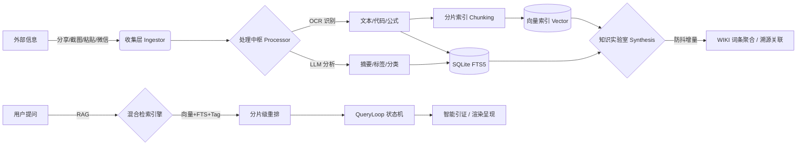

<div align="center">
  
  <h1>📦 Note All</h1>
  <p><b>碎片随手记，AI 即刻懂</b></p>
  <p>一款专注于"无感收集、AI 自动提取、极速检索"的个人碎片化知识管理系统</p>

  <p>
    <a href="https://github.com/your-username/note_all/stargazers"></a>
    <a href="https://github.com/your-username/note_all/network/members"></a>
    <a href="https://github.com/your-username/note_all/issues"></a>
    <a href="https://github.com/your-username/note_all/blob/main/LICENSE"></a>
  </p>
  
  <p>
    
    
    
    
  </p>

  <br>
  
</div>

---

## 🌟 核心理念

> **告别繁琐分类，让 AI 成为你的私人档案员。**
>
> 无论是网页链接、灵光一现、还是手机截图，只需"分享"或"粘贴"，剩下的交给 Note All。

---

## 📑 目录

- [核心特性](#-核心特性)
- [工作流图解](#️-工作流图解)
- [技术架构](#️-技术架构)
- [编译与打包](#️-编译与打包)
- [项目结构](#-项目结构)
- [文档中心](#-文档中心-documentation)
- [参与贡献](#-参与贡献-contributing)
- [License](#-license)

---

## ✨ 核心特性

Note All 将碎片化知识管理分为三个标准阶段，并引入了全新的 Wiki 构建系统：

### 📥 1. 无感收集 (Ingest)

| 特性 | 说明 |
|:---|:---|
| **Android 全局分享** | 系统原生集成，秒级归档 |
| **剪贴板智能嗅探** | App 获焦自动识别，一键入库 |
| **URL 智能剪藏** | 穿透反爬，Markdown 自动净化 |
| **Windows 全局热键** | `Alt+Q` 截图 / `Alt+Shift+Q` 闪记 |
| **原生多格式解析** | 支持 Word (`.docx`) 及所有主流代码/纯文本格式，自动补齐高亮 |
| **微信 ClawBot 接入** | 扫码即可将微信变为你的私人闪记入口 |

### 🧠 2. 深度处理 (Process)

| 特性 | 说明 |
|:---|:---|
| **OCR 极速识别** | 自研流水线，图片秒变文字 |
| **LLM 结构化分析** | 自动生成摘要，终结未命名时代 |
| **增量 WIKI 防抖重构** | 采用基于 `sync.Map` 的极简防抖聚合，支持碎片笔记自动汇聚生长为 Wiki 词条 |
| **多模态消息处理** | 不仅处理文字，更支持图片、文件自动收录 |
| **混合引擎** | 基于 SQLite FTS5 的全文检索与本地向量检索并行 |
| **自定义 AI 模板** | 支持内建（如智能整合、对比分析等）与自定义 Prompt 模板 |

### 🔍 3. 极速消费 (Consume)

| 特性 | 说明 |
|:---|:---|
| **RAG 语义问答** | 基于全库知识的深度对话与智能引证溯源 |
| **混合检索引擎** | #标签联想、OCR 文本、AI 摘要并行 |
| **全能沉浸式阅读** | 搭载 CodeMirror 6 源码视图，支持 vi 风格沉浸式正则搜索跳转 |
| **高定质感 UI 设计** | 基于 `DESIGN.md` 设计系统，具有光影层次、毛玻璃浮层与极佳的微交互反馈 |
| **智能记忆拼图** | WIKI 溯源档案一键回放，支持幽灵节点图谱预览 |
| **全离线导出** | 支持一键打包带物理附件的标准 Markdown 归档 ZIP |

---

## 🛠️ 工作流图解



---

## 🏗️ 技术架构

<details>
<summary>点击展开技术实现细节</summary>

| 模块 | 技术栈 | 说明 |
|:---|:---|:---|
| **服务端** | Golang + SQLite (FTS5) + Vector | 极致轻量，单文件运行，内置语义向量检索 |
| **Web 前端** | React 18 + Vite + TailwindCSS | SSE (Server-Sent Events) 达成全系统实时局部状态更新 |
| **PC 客户端** | Golang (Win32 API) | 纯血托盘程序，注册系统级原子热键 |
| **Android 客户端** | Kotlin + Jetpack Compose | 深度收编系统 Share Sheet 流量入口 |
| **AI 萃取中台** | DeepSeek + PaddleOCR + ERNIE | 多模型联动：DeepSeek 逻辑提炼 + 百度 VLM 视觉感官 |
| **WIKI 炼金引擎** | 自研 | 跨笔记全量上下文防抖计算，支持多对多父子关联与幽灵节点清理 |

</details>

---

## 🛠️ 编译与运行 (Build & Run)

```powershell
# Windows 环境下一键还原依赖并编译所有模块
.\build.ps1 -Module all
```
详细的编译步骤（含 ARM64 交叉编译与本地 Python 向量模型部署）与环境配置请参考 [安装指南](docs/installation.md)。

---

## 📂 项目结构

```text
.
├── android_client/    # Android 应用 (Jetpack Compose)
├── backend/           # Golang 服务端核心 (Gin + Gorm)
├── browser_extension/ # 浏览器剪藏协议实现
├── docs/              # 详细技术与功能规格文档
├── frontend/          # React Web 界面 (Vite + TailwindCSS)
├── pc_client/         # Windows 托盘程序 (CGO + Win32)
└── .github/           # 开源社区模板及自动化配置 (PR/Issue Templates)
```

---

## 📖 文档中心 (Documentation)

| 文档 | 说明 |
|:---|:---|
| [🚀 快速开始](docs/installation.md) | 环境要求、依赖编译与运行指南 |
| [💡 用户指南](docs/usage.md) | Android/PC/Web/微信等多端使用技巧 |
| [🏗️ 技术架构](docs/design/architecture.md) | RAG 检索设计、Agent 状态机、系统拓扑 |
| [🤖 Agent 设计](docs/design/agent.md) | 多轮对话 Agent 架构与实现细节 |
| [🔌 API 参考](docs/api-reference.md) | 后端服务 RESTful API 接口定义 |
| [🤝 代理人开发规范](AGENTS.md) | 前端 UI 规范与大模型代理接入必读指南 |

---

## 🤝 参与贡献 (Contributing)

我们非常欢迎社区的贡献！无论是修复 Bug、添加新功能，还是改进文档，你的帮助都将使 Note All 变得更好。

- 欲了解开发流程与架构规范，请首先阅读 [贡献指南](CONTRIBUTING.md) 和 [代理人开发规范](AGENTS.md)。
- 提交代码前，请确保遵循了 [设计规范](DESIGN.md) 和 [行为准则](CODE_OF_CONDUCT.md)。

---

## 📄 License

本项目基于 [MIT License](LICENSE) 开源。