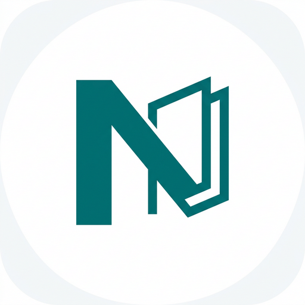

<div align="center">
  
  <h1>📦 Note All<br>(个人知识收集与检索系统)</h1>

  <p>
    
    
    
    
    
  </p>
</div>

> 一款专注于“无感收集、AI自动提取、极速检索”的碎片化知识管理神器。告别传统笔记的繁琐分类，随时随地分享文字与截图，让大模型为你打理一切！

---

## ✨ 1. 核心特性 (Features)

为了满足“多端便捷收集”、“自动化信息提取”、“轻便检索”的目标，系统划分为三大核心能力：

### 📥 无感收集 (Ingestor)
*   📱 **Android 原生端**
    *   **全局系统分享 (Share Target)**：支持将相册图片、浏览器链接、各类APP文本通过安卓系统自带的“分享”面板一键发送至本应用，发送完无缝退回原应用。
    *   **剪贴板智能嗅探**：App 启动或获焦时，自动嗅探剪贴板内容（支持文本/图片链接），弹出顶部提示条，点击即可「一键入库」。
*   💻 **Web / PC 桌面端**
    *   **快速上传通道**：Web 端提供常规的拖拽上传和全局粘贴（Ctrl+V）能力。
    *   **多模式直录**：针对网文摘抄、想法随手记等纯文本，跳过 OCR 直接调用大模型提炼摘要与标签，响应极速。
    *   **智能网址剪藏 (URL Fetcher)**：丢入任何 HTTP(S) 长链接，系统将自动穿透反爬护盾（内置了**Jina 云端 + Readability 本地双解析引擎**，遭大厂 WAF 拦截也能防灾收录源链接），并无缝剥离广告提取原净字文为 Markdown 格式！更附带短文节流拦截系统以节约 AI 算力。
    *   **PC 右键集成**：Windows 原生客户端，注册资源管理器右键菜单，右击任意图片一键直飞云端。
    *   **全局热键截屏上传**：按下 `Alt+Q` 唤起全屏半透明遮罩（支持多显示器），鼠标框选区域后自动裁切上传。
    *   **全局热键文本闪记**：按下 `Alt+Shift+Q` 弹出行内纯文本快捷录入窗口，可自动填充物理剪贴板内容。

### 🧠 处理中枢 (Processor)
图片、截图或文本上传后，系统在后台异步并行执行解析流水线：
*   **底层信息剥除与 OCR 提取**：提取截图/图片中的所有可用文本或长链接背后的网页 HTML 净化处理，持久化落库建立倒排索引。
*   **大模型结构化分析 (VLM / LLM)**：
    *   **自动标签提取 (Auto-Tagging)**：识别内容主题（如：代码、菜谱、票据等）。
    *   **自动命名与摘要**：生成一句话的高度概括描述摘要，终结“未命名图片”时代。
    *   **短文本熔断策略 (Circuit Breaker)**：若监测到网页触发反爬盾牌导致抓取字数极少，精准切断送往 LLM 的流水线，直接写入关联主机域名/防灾降级标签（如：URL地址, zhihu.com）。

### 🔍 消费与检索 (Consumer)
*   **状态机流转机制 (Inbox)**：所有新收集内容首选进入 Inbox，处理核对无误后归入“特定知识库区”。
*   **多维极速检索**：支持对“OCR识别文本”、“AI生成的摘要”、“智能标签”、“日期”进行混合搜索。搜索框输入 `#` 符号开启极速跨表标签联想下拉引擎。
*   **🧠 智能交互与问答 (Insight Engine)**：
    *   **基于 RAG 的语义对话**：系统会根据您的提问，自动检索最相关的笔记碎片作为背景上下文。您可以与 AI 进行多轮对话，深度挖掘知识关联，不再只是简单的关键词匹配。
    *   **智能引证 (Smart References)**：AI 的回答会清晰附带“引证卡片”，点击即可溯源至原始笔记或图片，确保回答真实可查。
    *   **全功能渲染支持**：AI 会话与详情页深度集成 `Markdown` 解析器，完美支持 **科技感 GFM 表格**、**KaTeX 数学公式**、层级列表以及多语言语法高亮代码块。
*   **RAW 原文校勘系统**：Web与Android端详情页完美支持 `RAW 模式` 切换！不但能查看底层的机器识别文本结果，还能纯手工对遗漏/错乱段落进行校正；**保存后，直接驱动后端大模型重新提炼刷新摘要与标签！** 实现完美人机交互闭环。

---

## 🏗️ 2. 技术栈架构 (Tech Stack)

团队贯彻极致的 KISS 工程原则与轻量化多端联调需求：

*   **服务端 (Backend)**：`Golang` + `SQLite` (启用 FTS5 引擎)。高并发、单文件极致运行、极低内存消耗，配合自研单机 FS 文件服务，**屏蔽所有诸如 Redis/MinIO 的重型三方中间件部署羁绊。**
*   **Web 前端 (Frontend)**：`React 18` + `Vite` + `TailwindCSS`。基于长短轮询数据探针 (`useDataPoller`) 达成自动静默无感局部刷新，完美分离视图渲染与阻塞型 IO 操作。
*   **PC 客户端 (Windows)**：`Golang (Win32 API)` 纯血打造托盘后台留驻程序，双缓冲彻底消除 GUI 渲染闪烁，注册系统级全局原子热键中断拦截。
*   **Android 客户端 (App)**：基于 `Kotlin` + 现代化 `Jetpack Compose` 构建丝滑的响应式 UI。深度挖掘 Android 原始 Intent 握手机制收编 Share Sheet 流量入口，最低向下兼容至 Android API 24 (7.0)，全面拥抱 JDK 21 高版本语法特性。
*   **AI 萃取中台**：采用 `百度飞桨 (PaddleOCR)` 管辖边界本地的轻量物理视觉识别，对接并高度依赖 `ERNIE 文心大模型` / `DeepSeek` 等云侧大脑完成最终的高位语义抽取与推断。

---

## 🚀 3. 快速启动 (Quick Start)

### ⚙️ 后端服务 (Backend API)
只需确保拥有 Go 1.21+ 环境即可一键启动：
```bash
cd backend
# 复制配置并按需填入大模型 ApiKey
cp config.json.example config.json
# 运行
go mod tidy
go run main.go
```
> 服务默认在 `http://localhost:8080` 启动，上传实体和数据库文件均落盘于 `backend/` 下。

### 🌐 Web 前端 (React Frontend)
推荐 Node.js 18+ 以运行稳定 Vite 底座：
```bash
cd frontend
npm install
npm run dev
```
> 访问 `http://localhost:3000` 即可体验。

### 📱 Android 客户端 (Android App)
要求环境：Android Studio Iguana 或更高版本 (推荐使用 JDK 21)。
```bash
cd android_client
# 打开工程，允许 Gradle 同步 (我们提供开箱即用的阿里云与腾讯镜像)
# Run 'app' 
```
> 运行后可将 Note All 设置为您手机的默认分享接收器，享受随手一键归档的快感。后端地址（宿主局域网 IP 或模拟器专属隧道 `10.0.2.2:8080`）可在右上角齿轮⚙️动态设置。

### 💻 PC 客户端 (Windows Win32 Tray)
需要 Go 与配套的 CGo / GCC（MinGW-w64）支持：
```powershell
cd pc_client
cp config.json.example config.json
.\build.ps1
```
> 运行 `dist/note_all_pc.exe` 后，右键常驻托盘图标选择「注册右键菜单」。之后即可在全局环境使用 `Alt+Q` 感受丝滑截图瞬发布体验；使用 `Alt+Shift+Q` 唤出闪充笔记本。
