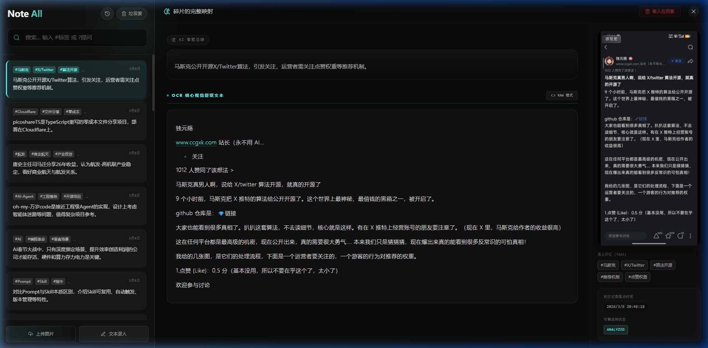
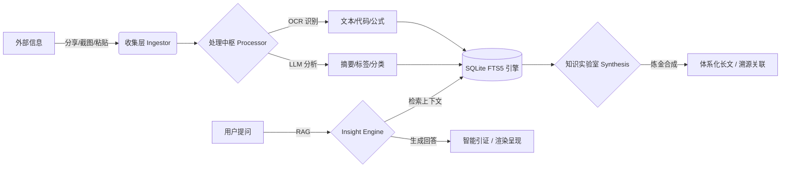

<div align="center">
  
  <h1>📦 Note All</h1>
  <p><b>碎片随手记，AI 即刻懂</b></p>
  <p>一款专注于“无感收集、AI 自动提取、极速检索”的个人碎片化知识管理系统</p>

  <p>
    
    
    
    
    
  </p>

  <br>
  
</div>

---

## 🌟 核心理念

> **告别繁琐分类，让 AI 成为你的私人档案员。**  
> 无论是网页链接、灵光一现、还是手机截图，只需“分享”或“粘贴”，剩下的交给 Note All。

---

## ✨ 核心特性

| 📥 无感收集 (Ingest) | 🧠 处理中枢 (Process) | 🔍 消费检索 (Consume) |
| :--- | :--- | :--- |
| **Android 全局分享**：系统原生集成，秒级归档 | **OCR 极速识别**：自研流水线，图片秒变文字 | **RAG 语义问答**：基于全库知识的深度对话 |
| **剪贴板智能嗅探**：App 获焦自动识别，一键入库 | **LLM 结构化分析**：自动生成摘要，终结未命名时代 | **智能引证**：AI 回答实时溯源，确保真实可靠 |
| **URL 智能剪藏**：穿透反爬，Markdown 自动净化 | **智能标签 (Auto-Tag)**：根据内容深度提取主题特性 | **混合检索引擎**：#标签联想、OCR文本、AI摘要并行 |
| **Windows 全局热键**：`Alt+Q` 截图 / `Alt+Shift+Q` 闪记 | **短文本熔断策略**：精准防御垃圾信息，节约 AI 算力 | **全功能渲染**：KaTeX 公式、GFM 表格一网打尽 |
| **浏览器剪藏扩展**：划词剪藏及扩展弹窗，补全 PC 工作流 | **自定义 AI 模板**：支持内建与自定义 Prompt 模板 | **智能记忆拼图**：AI 串联随机碎片激发灵感<br>**隐式双链**：基于标签自动发现并串联知识点 |
| **知识实验室 (Synthesis)**：跨上下文素材挑拣，炼金合成为长文 | **VLM 多模态感知**：深度解析图像内容，图文融合理解 | **知识溯源 (Lineage)**：合成笔记自动记录来源，支持一键跳回 |

---

## 🛠️ 工作流图解



---

## 🏗️ 技术架构 (Tech Stack)

<details>
<summary>点击展开技术实现细节</summary>

- **服务端 (Backend)**: `Golang` + `SQLite (FTS5)`。极致轻量，单文件运行，屏蔽所有重型中间件。
- **Web 前端 (Frontend)**: `React 18` + `TailwindCSS`。长短轮询探针 (`useDataPoller`) 达成局部无感刷新。
- **PC 客户端 (Windows)**: `Golang (Win32 API)`。纯血托盘程序，注册系统级原子热键。
- **Android 客户端 (App)**: `Kotlin` + `Jetpack Compose`。深度收编系统 Share Sheet 流量入口。
- **AI 萃取中台**: `PaddleOCR` (本地) + `ERNIE / DeepSeek` (云端)。
- **知识炼金引擎**: 跨笔记全量上下文计算，支持多对多父子关联溯源。

</details>

---

## 🧪 知识实验室 (Knowledge Lab)

知识实验室是 Note All 的进阶工作流，旨在实现“**从碎片的无感收集到知识的有感升华**”：

- **暂存篮机制**：在主列表一键“吸入”素材，脱离搜索限制进行自由组合。
- **深度合成算法**：AI 不仅是做总结，更能发现素材间的因果、矛盾与逻辑连结，生成 Markdown 结构化长文。
- **归档流水线**：支持“合成即归档”，处理完的碎片自动移入归档库，保持主列表极简。
- **谱系溯源**：所有新知识都保留了原始碎片的链接，点击即可回到灵感的发生点。

---

---

## 🛠️ 编译与打包 (Build)

项目提供根目录统一构建脚本 `build.ps1` (PowerShell)：

```powershell
# 全量编译所有模块 (Backend, Frontend, PC, Android)
.\build.ps1 -Module all

# 仅编译特定模块
.\build.ps1 -Module backend   # 后端
.\build.ps1 -Module frontend  # 前端
.\build.ps1 -Module pc        # Windows 客户端
.\build.ps1 -Module android   # Android 客户端 (需 JDK 21)
```

> **环境要求**: Go 1.21+, Node.js 18+, JDK 21+, Android SDK (用于 App)。

---

## 📂 项目结构
```text
.
├── backend/           # Golang 服务端核心
├── frontend/          # React Web 界面
├── android_client/    # Android Jetpack Compose 源码
├── pc_client/         # Windows Win32 托盘程序
└── browser_extension/ # Chrome/Edge 浏览器剪藏扩展
```
