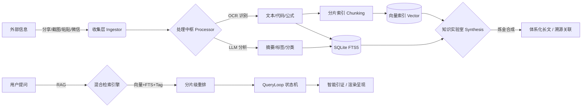

<div align="center">
  
  <h1>📦 Note All</h1>
  <p><b>碎片随手记，AI 即刻懂</b></p>
  <p>一款专注于“无感收集、AI 自动提取、极速检索”的个人碎片化知识管理系统</p>

  <p>
    
    
    
    
    
    
  </p>

  <br>
  
</div>

---

## 🌟 核心理念

> **告别繁琐分类，让 AI 成为你的私人档案员。**  
> 无论是网页链接、灵光一现、还是手机截图，只需“分享”或“粘贴”，剩下的交给 Note All。

---

## ✨ 核心特性

| 📥 无感收集 (Ingest) | 🧠 处理中枢 (Process) | 🔍 消费检索 (Consume) |
| :--- | :--- | :--- |
| **Android 全局分享**：系统原生集成，秒级归档 | **OCR 极速识别**：自研流水线，图片秒变文字 | **RAG 语义问答**：基于全库知识的深度对话 |
| **剪贴板智能嗅探**：App 获焦自动识别，一键入库 | **LLM 结构化分析**：自动生成摘要，终结未命名时代 | **智能引证**：AI 回答实时溯源，确保真实可靠 |
| **URL 智能剪藏**：穿透反爬，Markdown 自动净化 | **智能标签 (Auto-Tag)**：根据内容深度提取主题特性 | **混合检索引擎**：#标签联想、OCR文本、AI摘要并行 |
| **Windows 全局热键**：`Alt+Q` 截图 / `Alt+Shift+Q` 闪记 | **短文本优化策略**：少于 50 字直接使用原文作摘要，节约 AI 算力 | **全功能渲染**：KaTeX 公式、GFM 表格一网打尽 |
| **浏览器剪藏扩展**：划词剪藏及扩展弹窗，补全 PC 工作流 | **自定义 AI 模板**：支持内建与自定义 Prompt 模板 | **智能记忆拼图**：AI 串联随机碎片激发灵感<br>**隐式双链**：基于标签自动发现并串联知识点<br>**知识溯源 (Lineage)**：合成笔记自动记录来源，支持一键跳回 |
| **微信 ClawBot 接入**：扫码即可将微信变为你的私人闪记入口 | **多模态消息处理**：不仅处理文字，更支持图片、文件自动收录 | **微信双向交互**：支持在微信端发起问答并实时获得 RAG 回复 |

---

## 🛠️ 工作流图解



---

## 🏗️ 技术架构 (Tech Stack)

<details>
<summary>点击展开技术实现细节</summary>

- **服务端 (Backend)**: `Golang` + `SQLite (FTS5)`。极致轻量，单文件运行，屏蔽所有重型中间件。
- **Web 前端 (Frontend)**: `React 18` + `TailwindCSS`。长短轮询探针 (`useDataPoller`) 达成局部无感刷新。
- **PC 客户端 (Windows)**: `Golang (Win32 API)`。纯血托盘程序，注册系统级原子热键。
- **Android 客户端 (App)**: `Kotlin` + `Jetpack Compose`。深度收编系统 Share Sheet 流量入口。
- **AI 萃取中台**: `PaddleOCR` (本地) + `ERNIE` (云端，默认) 或其他兼容 OpenAI API 的 LLM。
- **知识炼金引擎**: 跨笔记全量上下文计算，支持多对多父子关联溯源。

</details>

---

## 🧠 RAG 检索设计 (RAG Retrieval Design)

Note All 构建了一套高召回、轻量级的本地化 RAG 流程，核心逻辑遵循“宽进严重排”原则：

### 1. 意图探测与查询重写
- **智能意图分类**：通过多维关键词权重矩阵，自动识别用户当前处于 `搜索(search)`、`总结(summarize)`、`探索(explore)` 或 `创作(generate)` 状态。
- **本地同义词库扩展**：集成《哈工大同义词词林扩展版》（约 9 万条数据），利用 **SQLite FTS5** 实现毫秒级的本地语义词扩展，无需依赖外部 AI 接口。
- **精细化分词**：基于 `gse` 分词器进行词性标注，**仅对名词进行同义词扩展**，避免动词、形容词的误扩展，提升召回精准度。自动剥离停用词，将 query 转化为核心实体列表。

### 2. 混合检索引擎 (Hybrid Retrieval)
系统并行开启三个维度的检索通道，确保”任意命中的灵感均不被遗忘”：
- **向量检索 (Vector Search)**：基于本地 Embedding 模型的余弦相似度计算，门槛设为 0.78，负责捕获语义相关的模糊内容。使用 `sqlite-vector` 扩展实现 SIMD 加速，或 Go 内存回退模式。
- **全文检索 (FTS5)**：基于 SQLite 原生 FTS5 引擎，利用 **BM25 算法** 对 OCR 文本和摘要进行高基数匹配。支持多关键词 OR 合并查询。
- **标签雷达 (Tag Search)**：利用改写后的 Token 列表进行 `IN` 匹配，并给予其 **5 倍** 的基础评分加权，确保明确标记的知识始终排在最前。

> **性能优化**：`BatchHybridSearch` 将多关键词的向量、FTS、Tag 查询合并为批量操作，DB 查询次数从 6×N 降至 ~3 次。

### 3. 多维重排机制 (Re-Ranking)
检索结果通过动态权重计算最终 `Score`：
> **Score = 向量相似度(50%) + 全文匹配(25%) + 标签命中(15%) + 时效性权重(10%)**

- **动态权重调整**：纯 Tag 命中时自动提高 TagScore 权重至 80%，避免被时效性分数淹没。
- **图谱扩展 (Graph Expansion)**：自动提取 Top 检索项的关联笔记，通过图结构补全回答所需的背景知识。
- **时效性增强**：根据 `UpdatedAt` 计算衰减函数，优先呈呈现更有实时感的笔记。

### 4. 智能引证与溯源
- **上下文构建**：自动清理冗余信息，将检索到的片段按相关度压缩至 LLM 最优处理区间（约 8k-16k tokens）。
- **来源标识**：生成的 AI 回答中会明确标注引用来源，支持一键跳回原始 OCR 记录或点击查看素材谱系。

---

## 🤖 Chat Agent 多轮对话设计

Note All 构建了完整的多轮对话 Agent 系统，实现"理解上下文、追踪意图、智能改写"的深度交互体验：

### 核心架构

系统采用 **意图驱动 + 工具编排** 架构，由五大核心模块协同工作：

```
加载会话 → 意图分析 → [查询改写] → 工具执行 → QueryLoop → 更新上下文 → 保存历史
```

> 注：`[查询改写]` 仅在追问模式时触发，非必经步骤。

| 模块 | 职责 | 关键技术 |
|:---|:---|:---|
| **SessionManager** | 会话历史持久化、上下文维护 | SQLite 存储、Preload 避免N+1 |
| **IntentAnalyzer** | 识别意图类型（追问/切换/多步等） | 15个指代词库、关键词标记 |
| **QueryRewriter** | 指代词替换、术语扩展 | 同义词词林、焦点提取 |
| **ToolExecutor** | 执行检索/总结/对比/生成工具 | 混合检索、LLM 调用 |
| **Agent** | 主控流程编排、多步任务拆解 | 单例模式、错误中断 |

### 意图类型

系统支持 10 种意图类型，实现精细化对话理解：

| 意图 | 触发条件 | 处理策略 |
|:---|:---|:---|
| `new_topic` | 新查询、无历史上下文 | 检索 + 生成回答 |
| `follow_up` | 包含指代词（它、那个、上面）或追问标记 | 查询改写 + 历史整合 |
| `clarify` | "详细说说"、"展开"等澄清请求 | 扩展历史回答 |
| `switch` | "换个话题"、"不聊这个" | 重置上下文 |
| `multi_step` | "先...再..."、"然后"连接词 | 任务拆解、顺序执行 |
| `search` | "找"、"搜索"关键词 | 执行检索工具 |
| `summarize` | "总结"、"归纳"关键词 | 调用总结工具 |
| `compare` | "对比"、"比较"关键词 | 对比分析工具 |
| `generate` | "生成"、"写"、"创作" | 内容生成工具 |
| `record` | 纯备忘记录 | 直接存储 |

### 多步任务示例

用户："先找关于 Golang 的笔记，再总结它们的特点"

解析流程：
1. **子任务1**: `{query: "Golang", intent: "search"}` → 检索相关文档
2. **子任务2**: `{query: "总结特点", intent: "summarize"}` → 对检索结果生成摘要
3. **合并输出**: 返回总结内容 + 引用文档列表

### 历史压缩策略

当对话超过 **4 轮** 时，自动触发历史压缩：

- **保留最近 4 轮完整对话**
- **早期对话由 LLM 生成摘要**（≤500字），保留关键话题和文档 ID
- **摘要作为 system 消息注入**，确保上下文连续性

---

## 🧪 知识实验室 (Knowledge Lab)

知识实验室是 Note All 的进阶工作流，旨在实现“**从碎片的无感收集到知识的有感升华**”：

- **暂存篮机制**：在主列表一键“吸入”素材，脱离搜索限制进行自由组合。
- **深度合成算法**：AI 不仅是做总结，更能发现素材间的因果、矛盾与逻辑连结，生成 Markdown 结构化长文。
- **归档流水线**：支持“合成即归档”，处理完的碎片自动移入归档库，保持主列表极简。
- **谱系溯源**：所有新知识都保留了原始碎片的链接，点击即可回到灵感的发生点。

---

## 🤖 微信助手 (WeChat ClawBot)

Note All 集成了基于 **腾讯 iLink 协议** 的微信机器人，让你的微信瞬间变身为强大的生产力入口：

- **扫码极速接入**：在 Web 仪表盘侧边栏一键获取登录二维码，完成微信账号绑定。
- **无感知识收录**：直接向机器人发送文字、链接、图片或文档，系统将自动异步下载、加壳解密并存入收件箱。
- **智能问答 (Cloud RAG)**：集成 RAG 检索引擎。当你在微信提问时，助手会实时检索你的个人笔记库，并以深刻、简洁的口吻给出回答，同时附带参考来源。
- **远程交互中心**：Web 端支持实时聊天监控与手动回复，方便在管理后台直接参与对话。

---

## 🛠️ 编译与打包 (Build)

项目提供根目录统一构建脚本 `build.ps1` (PowerShell)：

```powershell
# 全量编译所有模块 (Backend, Frontend, PC, Android)
.\build.ps1 -Module all

# 仅编译特定模块
.\build.ps1 -Module backend   # 后端
.\build.ps1 -Module frontend  # 前端
.\build.ps1 -Module pc        # Windows 客户端
.\build.ps1 -Module android   # Android 客户端 (需 JDK 21)
```

> **环境要求**: Go 1.24+, Node.js 18+, JDK 21+, Android SDK (用于 App)。

---

## 📂 项目结构
```text
.
├── backend/           # Golang 服务端核心
├── frontend/          # React Web 界面
├── android_client/    # Android Jetpack Compose 源码
├── pc_client/         # Windows Win32 托盘程序
└── browser_extension/ # Chrome/Edge 浏览器剪藏扩展
```
